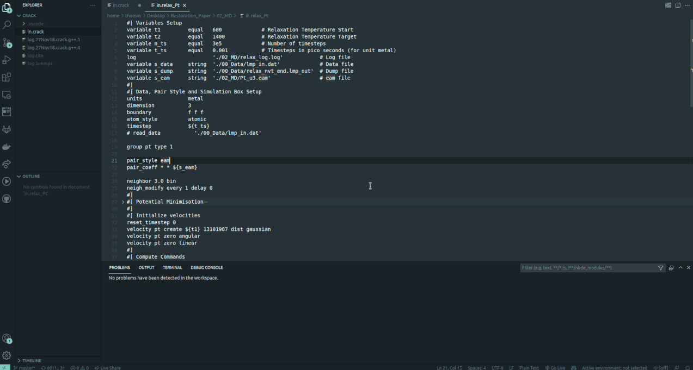

# Lammps Syntax in VSCode 

This extension is originally based on [lammps_vscode](https://github.com/ThFriedrich/lammps_vscode)

This extension is a VSCode extension, concisely for highlighting LAMMPS input files.

## Syntax/Keyword Highlighting

- Syntax Highlighting for Keywords, Variables and Data Types
- Folding possible between Markers #[ and #]
- Recognizes .lmp, .lmps and .lammps file extensions and files beginning with "in."
