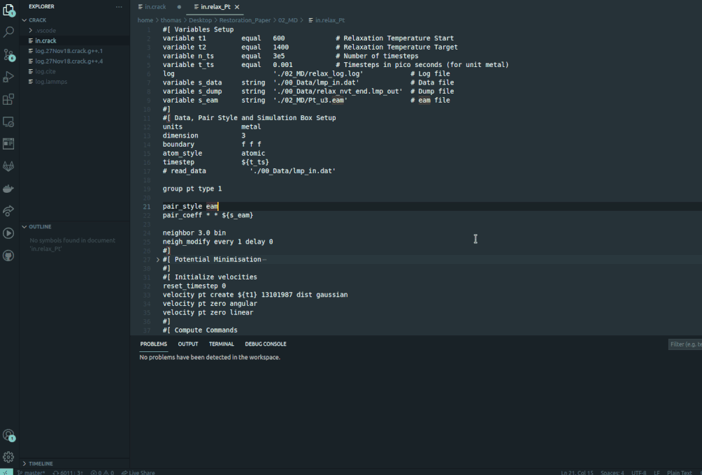

# LAMMPS Syntax in VSCode

A minimal VSCode extension concisely for highlighting LAMMPS input files.

This extension is originally based on [lammps_vscode](https://github.com/ThFriedrich/lammps_vscode), which stripped down to the bare minimal syntax highlighting, avoiding uncommon features and dependencies.

## Features
- Highlight the keywords in LAMMPS input files.
- Recognizes `*.lmp`, `*.lmps`, `*.lammps`, and `in.*` files as LAMMPS input files.
- Folding possible between Markers #[ and #]

